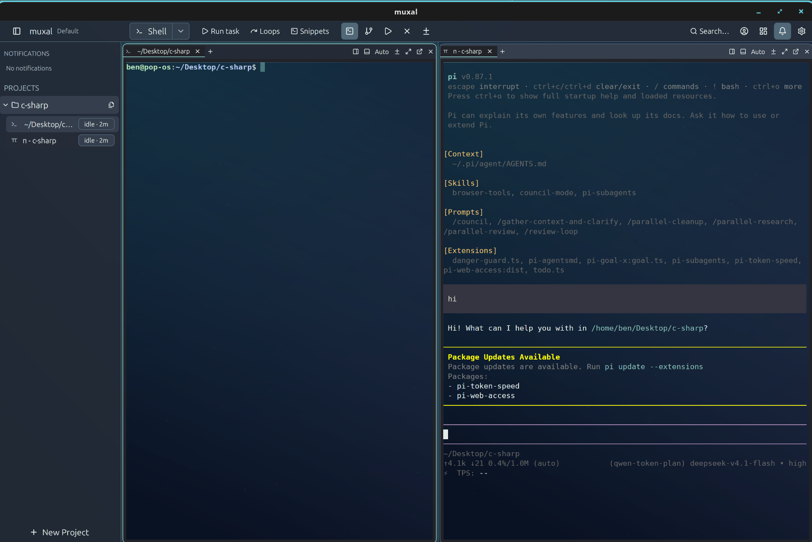

# muxal

**This is my reimagined version of the Muxel ADE.** It keeps the original's
core idea — a native desktop terminal multiplexer for running several coding
agents side by side — and rebuilds the experience around driving agents all
day: a single merged command bar, host-native window chrome, tiled and tabbed
panes that each embed a real terminal (Claude Code, opencode, Amp, pi, or a
plain shell), agent status at a glance, notifications when an agent finishes
or needs input, and first-class git-worktree flows — one window per branch, no
tmux keybindings required.

See [FEATURES.md](FEATURES.md) for the full feature catalogue, and
[docs/dev-main-workflow.md](docs/dev-main-workflow.md) for how this repo
develops itself (installed main + sandboxed dev).



---

## Install & run

- **Release packages** — the release workflow builds Linux `.deb` / `.rpm` /
  AppImage / `.tar.gz` (x86_64 + aarch64); install the one matching your distro.
- **From source (this machine)** — `scripts/install.sh`: release-builds muxal,
  installs the binary to `~/.local/bin/muxal`, and registers the launcher icon +
  `.desktop` entry pointing at it. Run `muxal` from your launcher, or by name if
  `~/.local/bin` is on your `PATH`.
- **Ad hoc** — run the build-tree binary in place, without installing:
  `cargo run -p muxal` (debug) or `cargo build --release -p muxal &&
  ./target/release/muxal`. It uses your **real** workspace, so it's for quick
  checks; for parallel/sandboxed testing use `scripts/dev.sh` instead.
- **Linux system deps** — a Wayland or X11 stack, `libxkbcommon`,
  fontconfig/freetype, and D-Bus (desktop notifications + tray). `git` and
  `tmux` are optional integrations; each agent CLI is installed separately.

## Update

- **In the app** — the update icon beside the settings gear checks GitHub on
  click and offers the new release in a dialog. Nothing is downloaded silently:
  the app only ever learns the release's name.
- **From a terminal** — one script installs *and* updates, verifying the
  release checksums and swapping atomically (the previous binary is kept as
  `muxal.bak`):

  ```sh
  curl -fsSL https://raw.githubusercontent.com/bencordeiro/muxal/master/scripts/get.sh | sh
  ```

  `--check` reports without changing anything, `--force` allows downgrades,
  `--system` installs to `/usr/bin`; it picks the right asset for your distro
  (`.deb` / `.rpm` / `tar.gz` / AppImage via `--appimage` / macOS `.zip`).

## Releases

Pushing a `v*` tag makes GitHub Actions build every package on native runners
and publish them to
[GitHub Releases](https://github.com/bencordeiro/muxal/releases) with
auto-generated notes:

| Platform | Assets |
| --- | --- |
| Debian / Ubuntu | `.deb` (x86_64, aarch64) |
| Fedora / RHEL / openSUSE | `.rpm` (x86_64, aarch64) |
| Any Linux | AppImage or `.tar.gz` (x86_64, aarch64) |
| macOS (Intel + Apple Silicon) | one universal `.dmg` + `.zip` |

macOS builds are ad-hoc signed (no Developer ID), so Gatekeeper warns on first
launch: right-click → Open, or
`xattr -dr com.apple.quarantine /Applications/muxal.app`. Windows is
intentionally not packaged — support is being phased out.

Tracked-but-unfixed issues (currently: terminal glyph spacing on Arch Linux)
live in [docs/known-issues.md](docs/known-issues.md).

## Under the hood

- **GPU rendering** — the whole UI, terminal panes included, is drawn by
  **GPUI** (Zed's GPU-accelerated UI framework): Metal on macOS, Vulkan on
  Linux. Window chrome, terminal cells, the spaceglass backdrop, and every
  overlay go through the same GPU paint pipeline.
- **CPU-side terminal emulation** — PTY handling and terminal state live in
  **`alacritty_terminal`**; muxal feeds its output to the GPUI renderer as text
  runs. The emulation is CPU code; the presentation is GPU.
- **Everything else is plain Rust** — the layout tree, agent-status detection,
  git/worktree and tmux integrations (subprocesses), and persistence have no
  GPU involvement.

## Dev / main workflow

muxal supports running an installed **main** and a sandboxed **dev** side by
side, so you can develop muxal *inside* muxal:

- **main** — the installed `~/.local/bin/muxal`, using your real workspace.
- **dev** — `scripts/dev.sh`: builds and runs against an isolated sandbox
  (`.muxal-dev/`), so testing never touches the real workspace. Safe to run in
  a pane of the running main. Args go to cargo (`--release`); anything after
  `--` goes to muxal.
- **promote dev → main** — `scripts/promote.sh`: release-builds the current
  tree and atomically swaps `~/.local/bin/muxal` (copy-then-rename, so it's
  safe even while main is running — the running process keeps its old inode).
  Restart main to pick up the new binary; the launcher entry needs no update.
- `MUXAL_BIN_DIR` overrides the install directory for both `install.sh` and
  `promote.sh`.
- Full notes, the two-instance rule, and a cheat sheet:
  [docs/dev-main-workflow.md](docs/dev-main-workflow.md).

## Scripts

| Script | Purpose |
| --- | --- |
| `scripts/dev.sh` | sandboxed dev instance |
| `scripts/install.sh` | one-time main install (binary + launcher) |
| `scripts/promote.sh` | push dev tree over installed main |
| `scripts/install-desktop.sh` | launcher icon + `.desktop` entry only (used by `install.sh`; `MUXAL_EXEC` overrides the Exec path) |
| `scripts/sign-macos.sh` | macOS signing / notarization |
| `scripts/translate.py` | i18n string extraction / translation helper |
| `scripts/get.sh` | user-facing install/update from GitHub Releases (checksum-verified) |
| `scripts/test-get.sh` | sandbox tests for `get.sh` (fake release server) |

---

## Credits

- **ProjectHax LLC** — the original **Muxel** ADE this fork is built on. Full
  credit to the original developers for an ADE that invites people to build on
  it; muxal is my reimagined take on their foundation.
- **[gpui](https://github.com/zed-industries/zed)** (Zed Industries,
  Apache-2.0) — the GPU-accelerated UI framework; and
  **[alacritty_terminal](https://github.com/alacritty/alacritty)**
  (Apache-2.0) — the terminal emulation core.
- **[Lucide](https://lucide.dev)** (ISC) — some icons in `assets/icons/`.

## License

**muxal is GPL-3.0** ([LICENSE](LICENSE)) — based on **muxel** by **ProjectHax
LLC**, used under that project's GPL-3.0 option (no affiliation or endorsement
implied). Everything here, including muxal's changes, ships under GPL-3.0 with
its source; changes from upstream are documented in [FEATURES.md](FEATURES.md)
and the git history. Contributions are licensed the same way — see
[CONTRIBUTING.md](CONTRIBUTING.md).

Upstream's commercial license covers *muxel* only and never muxal; details in
[LICENSING.md](LICENSING.md).
